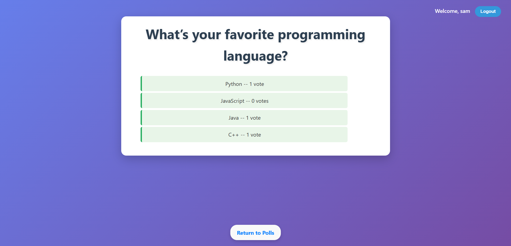

##  Django Polls Application
A full-featured polling application built with Django that allows users to vote on questions and view results. Features user authentication, vote tracking, and a responsive design.
### Features

- User Authentication: Login, logout, and signup functionality
- Poll Management: View available polls with publication date filtering
- Voting System: Users can vote once per question with duplicate vote prevention
- Results Display: View poll results with vote counts
- Responsive Design: Mobile-friendly interface with modern styling
- Admin Interface: Django admin for managing polls and choices

### Screenshots

### Screenshots

| Index Page | Detail Page |
|:----------:|:-----------:|
|  |  |
| *Main polls listing page* | *Poll detail page with voting options* |

| Results Page | Login Page |
|:------------:|:----------:|
|  |  |
| *Poll results with vote counts* | *User login interface* |

| Signup Page |
|:-----------:|
|  |
| *User registration form* |

### Prerequisites

Python 3.8+
Django 5.2+

### Setup Instructions

1. Clone the repository
<pre>     git clone https://github.com/yourusername/django-polls.git</pre>
<pre>     cd django-polls</pre>

2. Create a virtual environment
<pre>     python -m venv venv </pre>
<pre>     source venv/bin/activate   </pre>
On Windows:
<pre>     venv\Scripts\activate</pre>

3. Install dependencies
<pre>     pip install django</pre>

4. Run database migrations
<pre>     python manage.py makemigrations 
     python manage.py migrate</pre>

5. Create a superuser (optional)
<pre>      python manage.py createsuperuser </pre>

6. Start the development server
<pre>      python manage.py runserver  </pre>

7. Visit the application

Main application: http://127.0.0.1:8000/
Admin panel: http://127.0.0.1:8000/admin/


## Usage
### For Users

- Sign up for a new account or login with existing credentials
- Browse available polls on the main page
- Click on a poll to view details and vote
- Select your choice and submit your vote
- View results after voting
- Logout when finished

### For Administrators

- Access the Django admin panel at /admin/
- Create new questions and choices
- Manage user accounts
- Monitor voting activity

## Project Structure
<pre> ```
mysite/
├── mysite/
│   ├── settings.py          ## Project settings
│   ├── urls.py              ## Main URL configuration
│   ├── templates/
│   │   └── registration/
│   │       ├── login.html   ## Login page
│   │       └── signup.html  ## Signup page
│   └── wsgi.py
├── polls/
│   ├── models.py            ## Database models
│   ├── views.py             ## View functions and classes
│   ├── urls.py              ## App URL patterns
│   ├── admin.py             ## Admin configuration
│   ├── tests.py             ## Unit tests
│   ├── static/polls/
│   │   └── style.css        ## Custom styling
│   └── templates/
│       ├── base.html        ## Base template
│       ├── index.html       ## Polls listing
│       ├── detail.html      ## Voting interface
│       └── results.html     ## Results display
└── manage.py
```</pre>
## Models
### Question

question_text: The poll question (CharField)
pub_date: Publication date (DateTimeField)
was_published_recently(): Method to check if published within the last day

### Choice

question: Foreign key to Question
choice_text: Choice description (CharField)
votes: Vote count (IntegerField)

### Vote

user: Foreign key to User (tracks who voted)
question: Foreign key to Question
choice: Foreign key to Choice
Unique constraint prevents duplicate votes per user/question

## Key Features Explained
### User Authentication

- Built-in Django authentication system
- Custom signup view using UserCreationForm
- Login/logout functionality with redirects
- Protected voting requiring authentication

### Vote Prevention

- Vote model tracks user votes per question
- Prevents duplicate voting with database constraints
- User-friendly error messages for duplicate votes

### Safe Vote Counting

- Uses Django's F() expressions for atomic database updates
- Prevents race conditions in high-traffic scenarios
- Ensures accurate vote counting

### Future-Proof Publishing

- Filters out questions with future publication dates
- Only shows published questions in listings and detail views
- Admin can prepare questions in advance

### Testing
The project includes comprehensive tests for:

- Model methods (was_published_recently)
- View functionality (IndexView, DetailView)
- Future question handling
- Response status codes and content

Run tests with:
bashpython manage.py test polls

### Customization
#### Styling

- Modify polls/static/polls/style.css for visual changes
- Responsive design with mobile breakpoints
- CSS custom properties for easy theme modifications

#### Templates

- Extend base.html for consistent layout
- Customize individual page templates as needed
- Use Django template tags for dynamic content

### Settings

- Configure LOGIN_REDIRECT_URL and LOGOUT_REDIRECT_URL
- Modify TIME_ZONE for your location
- Adjust STATIC_URL for production deployments

## Contributing

- Fork the repository
- Create a feature branch (git checkout -b feature/amazing-feature)
- Commit your changes (git commit -m 'Add some amazing feature')
- Push to the branch (git push origin feature/amazing-feature)
- Open a Pull Request

## License
- This project is licensed under the MIT License - see the LICENSE file for details.
## Acknowledgments

- Built following the Django official tutorial
- Uses Django's built-in authentication system
- Responsive design inspired by modern web standards

## Future Enhancements

- Add poll creation interface for regular users
- Implement poll expiration dates
- Add email verification for user registration
- Create REST API endpoints
- Add social media login options
- Implement poll categories and tagging
- Add vote analytics and charts
